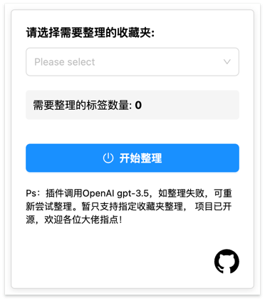
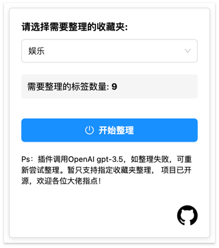
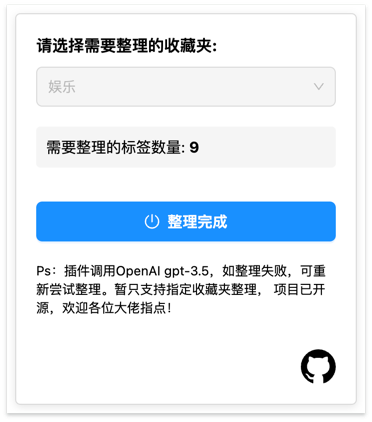
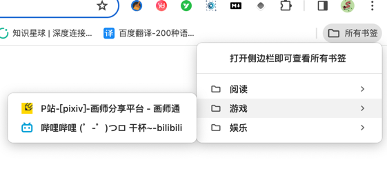

## 项目介绍

书签管理器，利用AI针对本地浏览器收藏夹中页签重新分类。

## 技术架构

使用的 Plasmo 框架完成， React + TypeScript。


## 效果图








## 目前面临问题

想实现一键针对所有的页签重新分类，但是面临上千页签整理时存在一下问题：

- 1.token限制问题，不能一次性完成。
- 2.分批处理可能会存在丢失页签的问题。
- 3.如果分批处理，可能存在分类重叠的问题。

希望有经验的大佬指教，小白一枚！


## 维护

### 1. 本地运行
在 config -> [openAIConfig.js](config%2FopenAIConfig.js)
中填入你的OpenAI Key 和 baseURL 即可。

```bash
pnpm dev
# or
npm run dev
```

### 2. 打包

```bash
pnpm build
# or
npm run build
```
